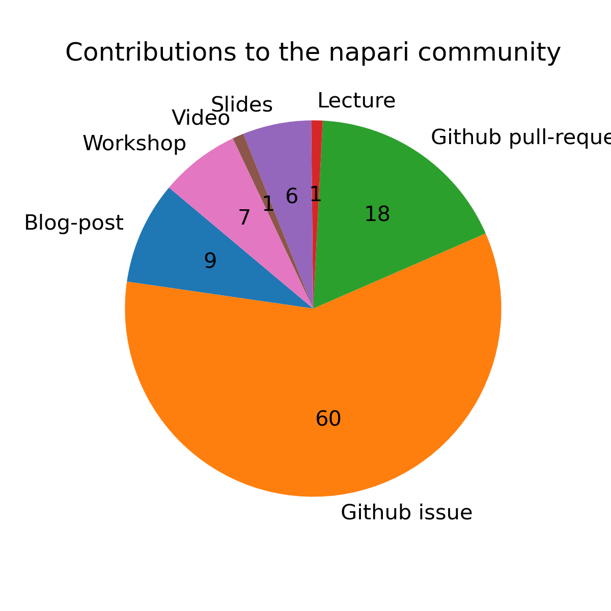
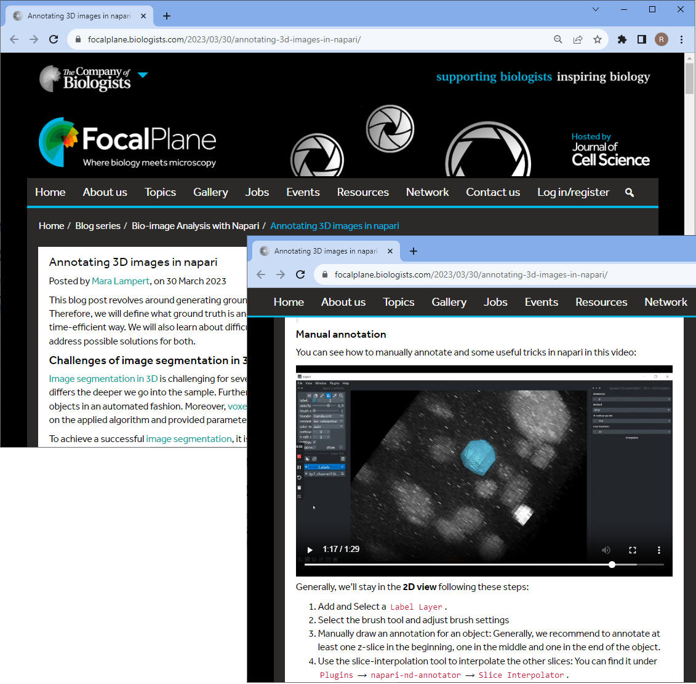
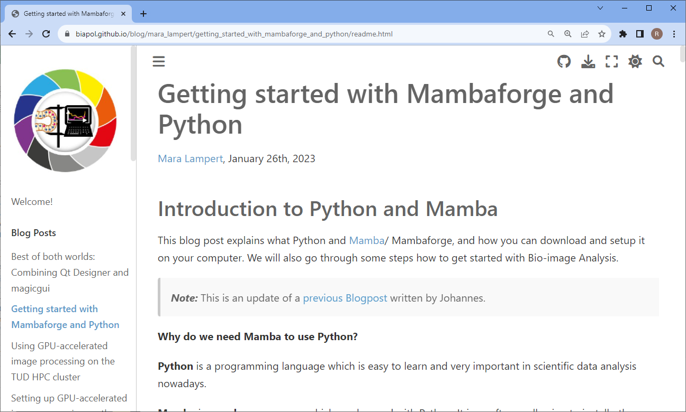
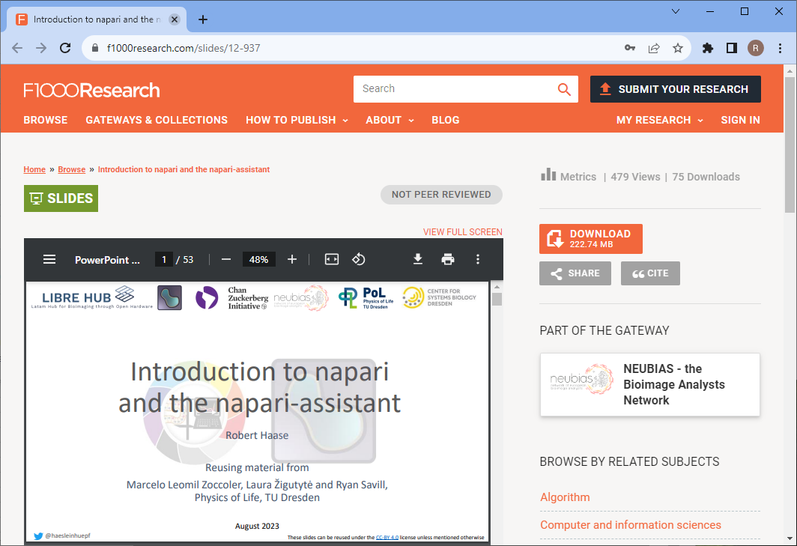
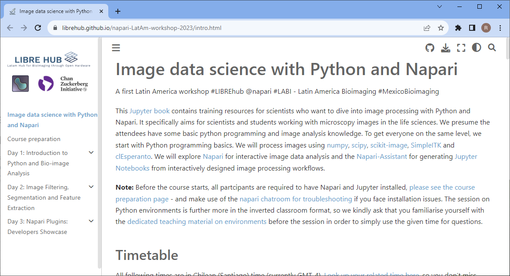

# Report on Project "Seamless Integration of Quantitative Bio-Image Analysis Plugins"

On this page we summarize our efforts in the CZI funded project [Seamless Integration of Quantitative Bio-Image Analysis Plugins](https://chanzuckerberg.com/science/programs-resources/imaging/napari/seamless-integration-of-quantitative-bio-image-analysis-plugins/). The original plan was to support the napari plugin community by providing guidance in making napari plugins interoperable and to produce user-documentation across plugins. 

## Summary

Our project team consisted of [Mara Lampert](https://github.com/marabuuu) and [Robert Haase](https://github.com/haesleinhuepf). We produced various materials as visualized in this overview pie chart.

We opened about 60 Github issues and 18 pull-requests, commonly supporting napari-plugin developers in enriching their documentation and making their napari-plugins work on other computers. Also, we assisted plugin developers in making their plugins interoperable with each other. In this way we contributed to about 30 napari plugins, the napari-core and the [napari-hub](https://napari-hub.org) website.

## Highlights

Following our original goal, we provided napari-plugin documentation in form of blog-posts and videos that show how to work with multiple napari-plugins together.

* [Rescaling images and Pixel Anisotropy](https://focalplane.biologists.com/2023/03/02/rescaling-images-and-pixel-anisotropy/)
* [Annotating 3D images in Napari](https://focalplane.biologists.com/2023/03/30/annotating-3d-images-in-napari/)
* [Quality assurance of segmentation results](https://focalplane.biologists.com/2023/04/13/quality-assurance-of-segmentation-results/)
* [Feature extraction in Napari](https://focalplane.biologists.com/2023/05/03/feature-extraction-in-napari/)
* [Tracking in Napari](https://focalplane.biologists.com/2023/06/01/tracking-in-napari/)
* [Bio-imaGE Analysis using Napari and Python (EMBO Practical Course, Video)](https://www.youtube.com/watch?v=QDS5t7oZH-c)

As life scientists in our local environment commonly struggle with installing napari, we also wrote a blog-post outlining how to do this:
* [Getting started with mambaforge and Python](https://biapol.github.io/blog/mara_lampert/getting_started_with_mambaforge_and_python/readme.html)

As guidance for napari-plugin developers and data scientists more broadly, we wrote blog posts introducing them to good practices for user documentation, licensing and sharing.
* [Scientific Data Analysis: User Documentation 101](https://focalplane.biologists.com/2023/04/30/scientific-data-analysis-user-documentation-101/)
* [If you license it, it'll be harder to steal it](https://focalplane.biologists.com/2023/05/06/if-you-license-it-itll-be-harder-to-steal-it-why-we-should-license-our-work/)
* [Sharing research data with zenodo](https://focalplane.biologists.com/2023/02/15/sharing-research-data-with-zenodo/)

We also shared slides of our presentations online:

* [Bio-image analysis using Napari and Python](https://f1000research.com/slides/12-972)
* [Introduction to napari and the napari-assistant](https://f1000research.com/slides/12-937)
* [GPU-acclerated Bio-Image Analysis using clesperanto](https://f1000research.com/slides/12-587)
* [Introduction to Napari](https://f1000research.com/slides/12-584)
* [From assistant to notebooks](https://f1000research.com/slides/12-573 https://f1000research.com/slides/11-1351)

We attended to teach others how to use Napari
* [Napari LaTam Workshop Image data science with Python and Napari](https://github.com/LIBREhub/napari-LatAm-workshop-2023)
* [PoL Bio-Image Analysis Training School on GPU-Accelerated Image Analysis](https://github.com/BiAPoL/PoL-BioImage-Analysis-TS-GPU-Accelerated-Image-Analysis)
* [PoL Bio-Image Analysis Training School - Early Career Track](https://github.com/BiAPoL/PoL-BioImage-Analysis-TS-Early-Career-Track)
* [Quantitative the Bio-Image Analysis with Python](https://github.com/BiAPoL/Quantitative_Bio_Image_Analysis_with_Python_2022)
* [DIGS-BB - Light Microscopy Course - Bio-Image Analysis 2022](https://github.com/BiAPoL/DIGS-BB_LM_Course_Bio-Image_Analysis_2022)
* [Image data science with Python and Napari @EPFL](https://github.com/BiAPoL/Image-data-science-with-Python-and-Napari-EPFL2022)
* [NEUBIAS Pasteur course on Bioimage Analysis](https://github.com/BiAPoL/Pasteur-NEUBIAS-training-school-on-Bioimage-Analysis)

Some of these workshops were organized as part of the CZI-EOSS cylce 4 project [GPU-accelerating Fiji and Friends Using Distributed CLIJ, NEUBIAS-style](https://chanzuckerberg.com/eoss/proposals/gpu-accelerating-fiji-and-friends-using-distributed-clij-neubias-style/).

## Complete list

You find a complete list of links to our actions in [this csv file](list.csv).

## Acknowledgements

This project has been made possible by grant number 2022-252520 from the Chan Zuckerberg Initiative  DAF, an advised fund of the Silicon Valley Community Foundation. This project was supported by the Deutsche Forschungsgemeinschaft under Germany’s Excellence Strategy – EXC2068 – Cluster of Excellence “Physics of Life” of TU Dresden. 